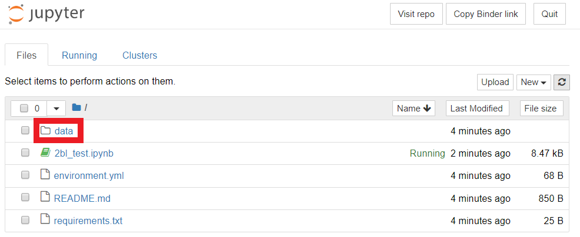
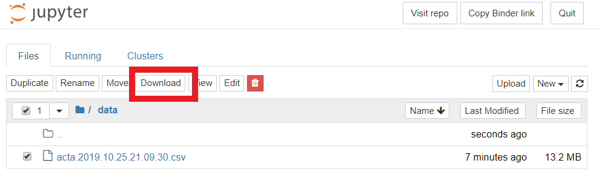
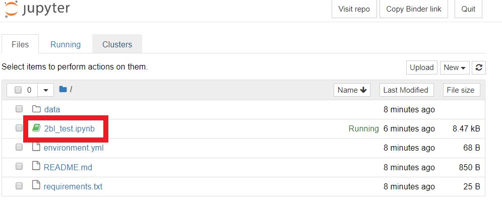
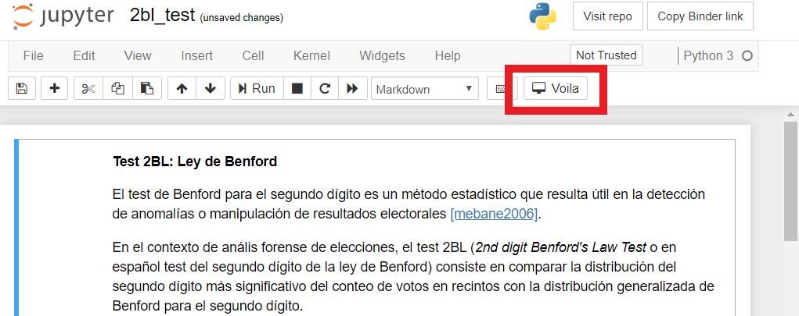

# Instrucciones

Al hacer click en la siguiente insignia, se creará y abrirá el entorno de trabajo.
Esto puede tardar un minuto.

El entorno de trabajo incluye el código, los datos y las librerías necesarias. 
Se pueden realizar cambios. 

El entorno de trabajo es efímero, se autodestruirá si está inactivo por mucho tiempo y con él 
todos los cambios realizandos durante la sesión.

En la carpeta "data" del entorno se encuentran los datos utilizados por los "Notebooks".

Se puede descargar los archivos desde la interfaz.

Cada análisis se encuentra contenido en un "Notebook" (archivo con la terminación ".ipynb").
Para iniciar un "Notebook" basta con darle click.

Para correr en "modo aplicación" (sólo ver el output del código), basta con darle click al botón "Voila".

Los notebooks contienen celdas de código y texto mezcladas. En las celdas de código se puede correr código arbitrario
e incluso instalar nuevas librerías y crear widgets interactivos cómo tablas, diagramas, etc.
Para más información acerca de los Jupyter notebooks: [Guía](https://www.datacamp.com/community/tutorials/tutorial-jupyter-notebook)